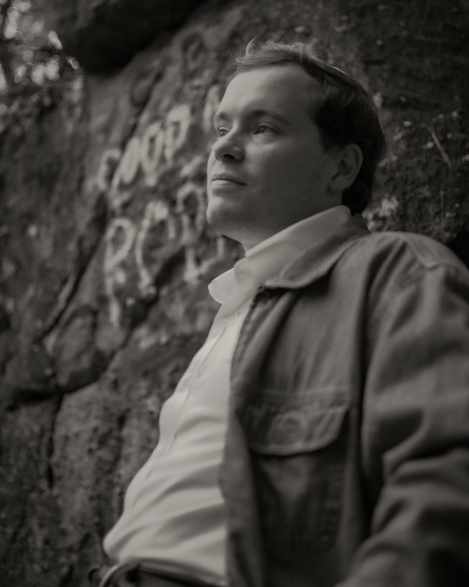

# PD Edgar, Texts and Technology Student
Get to know PD, a student at UCF's Texts &amp; Tech PhD program! 

# P.D. Edgar
Trustees Doctoral Fellow

Texts & Technology PhD Program

University of Central Florida

## About Me
P.D. Edgar has an MFA and a master’s in media studies from the U. of Alabama, where he was Art & Design Editor of Black Warrior Review. He’s now a Ph.D. student in Texts and Technology at the U. of Central Florida, where he studies poetry culture and electronic literature. PD grew up between Managua, Nicaragua, and Central Florida, and is a Freelance Typesetter and Graphic Designer that assists in the publication of graphic novel, literary magazine, and poetry chapbook publications. For more, [visit my CV](pages/My-CV.md)

## [Teaching Experience](teaching/index.md)

## Research Interests [(Visit my Projects!)](projects/index.md)
- Creative Writing (Pedagogy, Poetry & Nonfiction)
- Emerging Technology (AI, Virtual Reality, Social Media)		
- Print Culture History (Magazines, Feminism, Popular Literature)

## Published Poetry Sample
- "A Roundabout Way of Saying *Se Busca Asesino*", in [*Ghost Proposal*](https://ghostproposal.com/PD-Edgar)
- "At Least 18 Photos of Fish," in [*Ekphrastic Review*](https://www.ekphrastic.net/the-ekphrastic-review/at-least-18-photos-of-fish-by-p-d-edgar)

## Conference Papers
- ““Crisis” as a Catalyzing, Generative Program in Writing Classrooms” - Creative Writing Studies Conference, 2024
- “Docupoetics in 360: Experiments in Place-Memory as/in Virtual Reality” - Florida College English Association Conference, 2024
- “ChatGPoeT: Coaching AI & Poetic Forms” - Digitorium -  Alabama Digital Humanities Conference, 2024
- “‘The Only Character is an Old Woman, Fiercely Alive’: How Ms. Magazine’s Poetry Shaped What ‘Liberation’ Looked Like” - American Journalism Historians Association, Southeast Symposium, 2023

## Editorial Experience [+ Freelancing](freelance/index.md)
- *College Composition and Communication* : Editorial Assistant
- [*re•mediate* Literary Magazine](https://remediatelitmag.xyz) : Founding Editor
- [*Kenyon Review*](https://kenyonreview.org) : Digital Archive Associate
- [*Black Warrior Review*](https://bwr.ua.edu) : Art & Design Editor

### Contact Information
- Academic Inquiry : pe840191@ucf.edu
- Creative Inquiry : remediateeditor@gmail.com

### Follow Me!

[Bluesky](https://bsky.app/profile/pdedgar30.bsky.social) - [Instagram](https://www.instagram.com/pdedgar30/) - [Twitter](https://x.com/PDEdgar30) - [LinkedIn](https://www.linkedin.com/in/p-d-edgar/)
